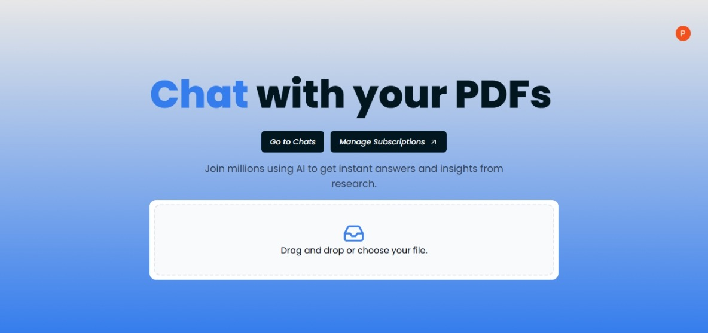
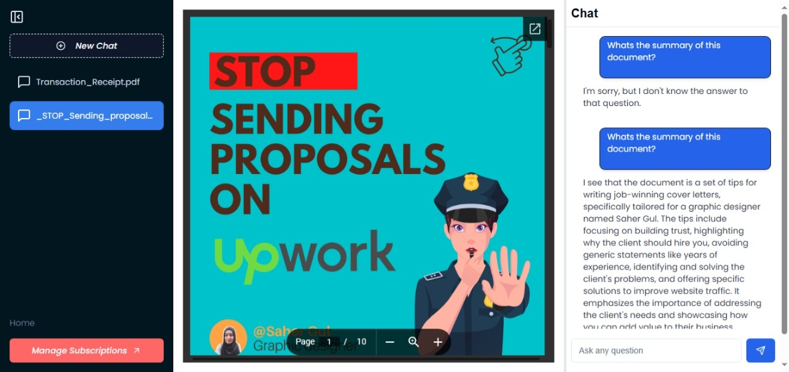

# Chat PDF

A smart, AI-powered web application designed to interact with your PDFs seamlessly. With an intuitive interface and cutting-edge features, PDF Buddy empowers users to extract insights and answers from their documents instantly.

## Features

- Instant PDF Interaction: Upload PDFs and chat with them in real-time.
- User-Friendly File Management: Drag-and-drop functionality for seamless file uploads.
- AI-Powered Insights: Gain instant answers and insights from your research papers, reports, and more.
- Subscription Management: Join millions to explore premium features effortlessly.

## Tech Stack

- **Framework:** Next.js
- **Styling:** Tailwind CSS
- **Vector Database:** Pinecone DB
- **Carousel:** Langchain
- **Postgres Database:** Neon DB
- **Authentication:** Clerk
- **AI Integration:** OpenAI API
- **File Storage:** AWS S3
- **File Upload:** React Dropzone
- **Payment Provider:** Stripe
- **State Management:** Zustand

## Screenshots

## Authors

Peter Uadiale

- [Website](https://www.peteruadiale.com/)
- [LinkedIn](https://www.linkedin.com/in/peter-o-uadiale-69541a19a/)
